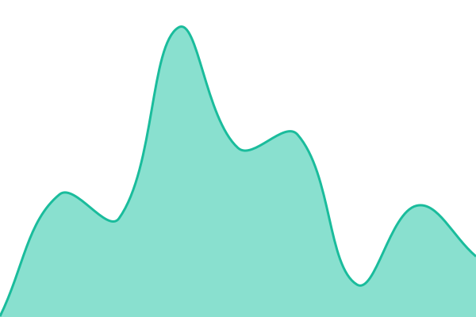
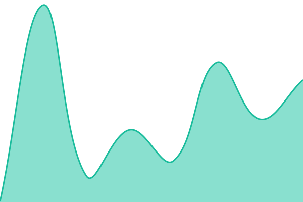
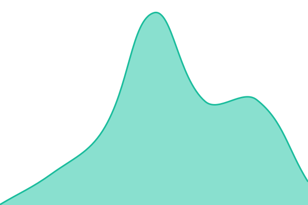
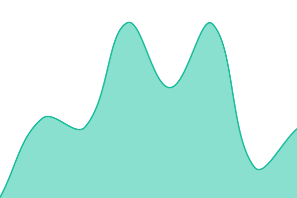
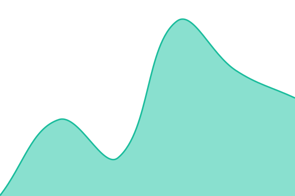
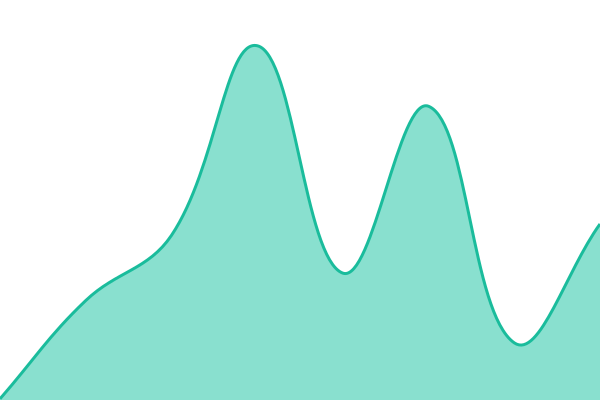

# [📈 Live Status](https://JorDunn.github.io/upptime): <!--live status--> **🟩 All systems operational**

This repository contains the open-source uptime monitor and status page for [Jordan Dunn](https://www.jordan-dunn.com), powered by [Upptime](https://github.com/upptime/upptime).

With [Upptime](https://upptime.js.org), you can get your own unlimited and free uptime monitor and status page, powered entirely by a GitHub repository. We use [Issues](https://github.com/JorDunn/upptime/issues) as incident reports, [Actions](https://github.com/JorDunn/upptime/actions) as uptime monitors, and [Pages](https://JorDunn.github.io/upptime) for the status page.

<!--start: status pages-->
<!-- This summary is generated by Upptime (https://github.com/upptime/upptime) -->
<!-- Do not edit this manually, your changes will be overwritten -->
<!-- prettier-ignore -->
| URL | Status | History | Response Time | Uptime |
| --- | ------ | ------- | ------------- | ------ |
|  [ntfy](https://ntfy.nodetwo.io/v1/health) | 🟩 Up | [ntfy.yml](https://github.com/JorDunn/upptime/commits/HEAD/history/ntfy.yml) | 

 233ms
     
 | 

<a href="https://status.nodetwo.io/history/ntfy">100.00%</a>
    

|  [Windmill](https://windmill.nodetwo.io) | 🟩 Up | [windmill.yml](https://github.com/JorDunn/upptime/commits/HEAD/history/windmill.yml) | 

 199ms
     
 | 

<a href="https://status.nodetwo.io/history/windmill">100.00%</a>
    

|  [Beszel](https://beszel.nodetwo.io) | 🟩 Up | [beszel.yml](https://github.com/JorDunn/upptime/commits/HEAD/history/beszel.yml) | 

 203ms
     
 | 

<a href="https://status.nodetwo.io/history/beszel">100.00%</a>
    

|  [Uptime Kuma](https://uptime.nodetwo.io) | 🟩 Up | [uptime-kuma.yml](https://github.com/JorDunn/upptime/commits/HEAD/history/uptime-kuma.yml) | 

 395ms
     
 | 

<a href="https://status.nodetwo.io/history/uptime-kuma">100.00%</a>
    

|  [Wealthfolio](https://wealthfolio.nodetwo.io) | 🟩 Up | [wealthfolio.yml](https://github.com/JorDunn/upptime/commits/HEAD/history/wealthfolio.yml) | 

 229ms
     
 | 

<a href="https://status.nodetwo.io/history/wealthfolio">100.00%</a>
    

|  [Outline](https://outline.nodetwo.io) | 🟩 Up | [outline.yml](https://github.com/JorDunn/upptime/commits/HEAD/history/outline.yml) | 

 202ms
     
 | 

<a href="https://status.nodetwo.io/history/outline">100.00%</a>
    

|  [Memos](https://memos.nodetwo.io) | 🟩 Up | [memos.yml](https://github.com/JorDunn/upptime/commits/HEAD/history/memos.yml) | 

 177ms
     
 | 

<a href="https://status.nodetwo.io/history/memos">100.00%</a>
    

<!--end: status pages-->

[**Visit our status website →**](https://JorDunn.github.io/upptime)

## 📄 License

- Powered by: [Upptime](https://github.com/upptime/upptime)
- Code: [MIT](./LICENSE) © [Anand Chowdhary](https://anandchowdhary.com)
- Data in the `./history` directory: [Open Database License](https://opendatacommons.org/licenses/odbl/1-0/)
